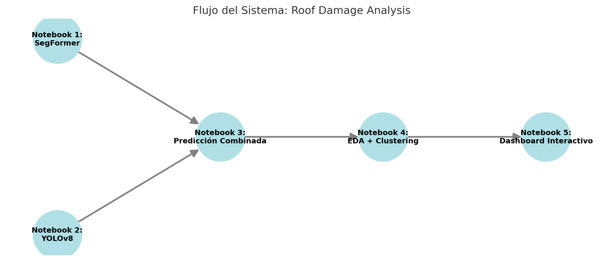

# 🏠 Roof Damage Analysis System

Este proyecto implementa un sistema completo para detección, segmentación, análisis y visualización de daños en techos a partir de imágenes aéreas. Abarca desde el entrenamiento de modelos hasta un dashboard web interactivo.

---

## 🧠 Motivación

Frente a la dificultad de inspeccionar techos manualmente, este sistema automatiza la identificación y análisis de daños usando visión por computador y herramientas modernas. Aunque desarrollado como proyecto aplicado, su diseño modular permite escalarlo a entornos reales.

---

## 📂 Estructura

```
roof_damage_analysis/
├── notebooks/              # Notebooks de entrenamiento, predicción, EDA
├── dashboard/              # Dashboard web con Dash + Bootstrap
├── model/                  # Modelos entrenados y métricas exportadas
├── data/                   # Dataset y enlaces referenciados
├── requirements.txt        # Dependencias
└── README.md               # Este documento
```

## 🔁 Flujo del Sistema




---

## 🚀 Tecnologías

- YOLOv8 para detección
- SegFormer para segmentación
- FastAPI + Ngrok para API REST
- Plotly Dash para el dashboard
- Hugging Face Hub para modelos y datos
- Python 3.11, Torch, scikit-learn, Catbox

---

## 📓 Notebooks

1. `1_segformer-inria.ipynb` – Segmentación de techos con SegFormer  
2. `2_yolov8_detection.ipynb` – Detección de daños con YOLOv8  
3. `3_troof-predictor.ipynb` – API REST de inferencia combinada (YOLO + SegFormer)  
4. `4_eda_metrics_analysis.ipynb` – EDA, clustering y exportación para dashboard

---

## 📊 Dashboard

Dashboard interactivo desplegado con:

- KPIs y distribución por cluster
- Galería por métricas (`damage_count`, `density`, etc.)
- Ejemplos representativos
- Descarga de CSV

🔗 [Dashboard en vivo (Render)](https://roof-dashboard.onrender.com)

---

## 📁 Modelos y Datos

- [YOLOv8 - Defect Detection](https://huggingface.co/jobejaranom/segformer-roofdefects)  
- [SegFormer - Roof Segmentation](https://huggingface.co/jobejaranom/segformer-inria-binary)  
- [Datos del Dashboard](https://huggingface.co/jobejaranom/roof-dashboard-data)

---

## 📐 Evaluación

- Se generaron curvas de pérdida, precisión, recall, F1 y mAP durante el entrenamiento.
- No se aplicó matriz de confusión porque:
  - En YOLOv8 se usó `single_cls=True` (una sola clase).
  - En clustering no supervisado no se dispone de etiquetas reales para comparar.

---

## ✅ Logros

- Flujo modular y reproducible de principio a fin.
- API REST funcional y accesible públicamente.
- Dashboard web conectado con datos reales.
- Subida estructurada a Hugging Face.
- Documentación clara, visual e interactiva.

---

## ⚠️ Limitaciones

- YOLOv8 no logró generalizar correctamente (mAP ≈ 0).
- Dataset limitado en tamaño, variedad y anotación.
- Clustering no contrastado con clases reales.

---

## ❤️ Reconocimiento

Este proyecto fue construido con esfuerzo real, integración de múltiples tecnologías, resolución de errores y capacidad crítica. Aunque con limitaciones, demuestra solidez técnica, modularidad y potencial de escalamiento.

---

## 🧾 Licencia

Distribuido bajo licencia MIT.